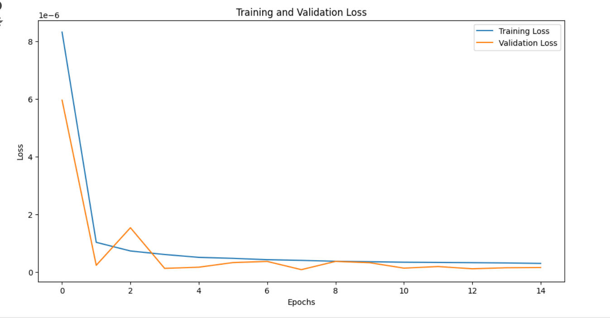

# Forecasting Bitcoin Prices with Time Series Analysis

## Introduction

Time series forecasting is a critical tool in financial markets, allowing investors and analysts to make informed decisions by predicting future trends based on historical data. Bitcoin (BTC), as a highly volatile cryptocurrency, presents a unique challenge for forecasting due to its price fluctuations driven by market sentiment, adoption rates, and global events. This project demonstrates how we can leverage deep learning techniques, specifically Long Short-Term Memory (LSTM) networks, to forecast Bitcoin prices using historical data.

---

## An Introduction to Time Series Forecasting

Time series forecasting involves predicting future values based on previously observed values in sequential data. In financial markets, time series analysis helps traders and investors anticipate market movements, optimize trading strategies, and mitigate risks. Predicting Bitcoin's price is valuable as it can guide trading decisions and investment strategies in one of the world's most volatile asset classes.

---

## DATASET

Data files for select bitcoin exchanges for the time period of Jan 2012 to December March 2021, with minute to minute updates of OHLC (Open, High, Low, Close), Volume in BTC and indicated currency, and weighted bitcoin price. Timestamps are in Unix time. Timestamps without any trades or activity have their data fields filled with NaNs.

## Preprocessing Method

To prepare the Bitcoin data for modeling, the following preprocessing steps were performed:

1. **Data Cleaning**: We removed any rows with missing values to ensure data consistency.
2. **Normalization**: The data was normalized using the `MinMaxScaler` to rescale features between 0 and 1, ensuring that the model trains efficiently without bias towards larger values.

```python
from sklearn.preprocessing import MinMaxScaler

# Normalize the data
scaler = MinMaxScaler()
scaled_data = scaler.fit_transform(df)
```

These preprocessing techniques are critical to ensure that the LSTM model can process the data effectively and produce reliable predictions.

---

## Setting Up tf.data.Dataset for Model Inputs

In time series forecasting, structuring the dataset for training is essential. Using TensorFlow's `tf.data.Dataset` API, we created a structured dataset by batching, shuffling, and applying windowing to efficiently manage our time series data.

- **Batching** ensures that the model processes multiple samples at once, optimizing training time.
- **Shuffling** helps prevent overfitting by randomizing the input sequence.
- **Windowing** creates subsequences (windows) from the data that the model can use to predict future prices.

```python
import tensorflow as tf

# Creating a TensorFlow dataset
dataset = tf.data.Dataset.from_tensor_slices((X, y))
dataset = dataset.shuffle(buffer_size=1024).batch(64).prefetch(tf.data.experimental.AUTOTUNE)
```

---

## Model Architecture

We used a **Long Short-Term Memory (LSTM)** model, which is well-suited for time series data due to its ability to capture dependencies across time steps.

### Model Summary:
- **LSTM layers**: Capture temporal dependencies in the sequential data.
- **Dense layer**: Outputs the predicted price for the next time step.

```python
from tensorflow.keras.models import Sequential
from tensorflow.keras.layers import LSTM, Dense

# Build the model
model = Sequential()
model.add(LSTM(50, return_sequences=True, input_shape=(X_train.shape[1], X_train.shape[2])))
model.add(LSTM(50, return_sequences=False))
model.add(Dense(25))
model.add(Dense(1))
```

We chose LSTM due to its proven ability to handle the sequential nature of time series data, making it ideal for predicting the fluctuating prices of Bitcoin.

---

## Results and Evaluation

The model's performance was evaluated using the **Mean Absolute Error (MAE)** and **Root Mean Squared Error (RMSE)**. Below is a graph comparing the predicted and actual BTC prices, showcasing the model's ability to capture price trends:



```python
# Evaluate model performance
mae = np.mean(np.abs((y_true - y_pred) / y_true)) * 100
rmse = np.sqrt(np.mean((y_true - y_pred) ** 2))
```

While the model captures general trends, some short-term fluctuations were harder to predict due to the high volatility of Bitcoin prices.

---

## Conclusion

Working on this Bitcoin forecasting task was a challenging yet rewarding experience. The highly volatile nature of BTC made it difficult to predict short-term movements, but the LSTM model was effective in identifying broader trends. 

Forecasting Bitcoin prices presents significant challenges due to the unpredictable nature of the market. However, with more advanced models and better data, the accuracy of such forecasts can be improved. Future work may explore using additional features like market sentiment or trading volume for enhanced prediction accuracy.

